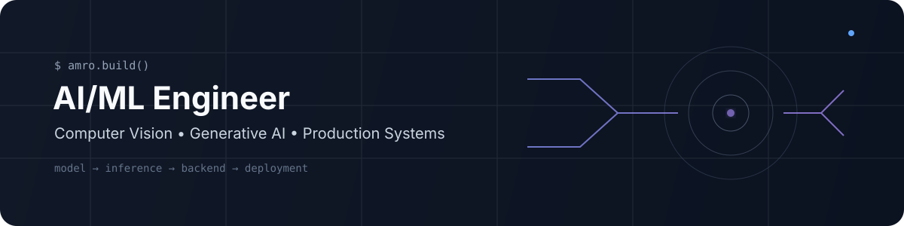
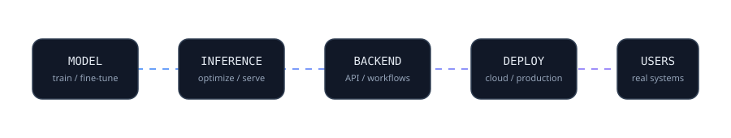

  <a href="https://www.linkedin.com/in/amro-rabea">LinkedIn</a> •
  <a href="mailto:amroalsafy@gmail.com">Email</a> •
  <a href="https://amro-rabea-portfolio.vercel.app">Portfolio</a>

## About

Computer Science graduate and freelance AI/ML engineer focused on building and deploying complete software systems. I work across machine learning, computer vision, generative AI, backend services, and production deployment — from models to user-facing applications.

## Selected Work

### [Dentop — AI-Powered Dental Clinic Platform](https://dentop-clinic.com/)

Production dental clinic platform with a live AI assistant powered by RAG.

- Handles appointment booking, cancellation, and rescheduling through natural language
- Answers clinic questions and retrieves relevant data
- Deployed as a real user-facing system

### [Elkhalily — E-commerce Platform](https://elkhalily1934.com/)

Full-stack e-commerce platform built for an Egyptian supermarket.

- Complete online ordering and fulfillment workflow
- **2,000+ customer orders** placed through the website and successfully fulfilled
- Built and deployed end-to-end

### [TissueInsight](https://github.com/amrorabea/TissueInsight)

Multimodal ML platform combining histopathology images and gene expression data for cancer analysis.

### [Intelligent Surveillance](https://github.com/amrorabea/intelligent-surveillance)

Natural-language video search system using object detection, tracking, visual embeddings, and vector search.

## Open Source

### [Kornia](https://github.com/kornia/kornia)

Contributed to the open-source computer vision library Kornia.

- Migrated five test classes in `tests/filters/` to the `BaseTester` framework
- Updated assertions and device/dtype test parametrization
- Verified the changes with **112 passed, 3 skipped**
- [View merged contribution →](https://github.com/kornia/kornia/pull/3873)

## Core Stack

**AI/ML:** PyTorch • Transformers • Diffusion Models • LLMs • RAG • Computer Vision • Multimodal Learning

**Backend:** Python • FastAPI • Node.js • REST APIs • Celery • Redis

**Infrastructure:** Docker • Linux • Git • Cloud Deployment

### Building AI systems that make it from model → production.

